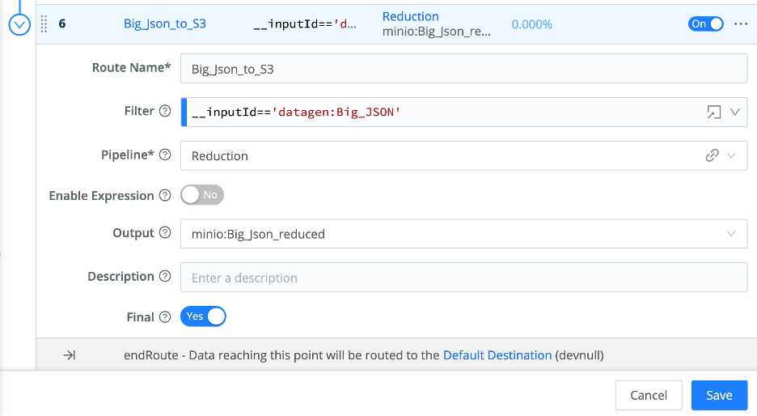
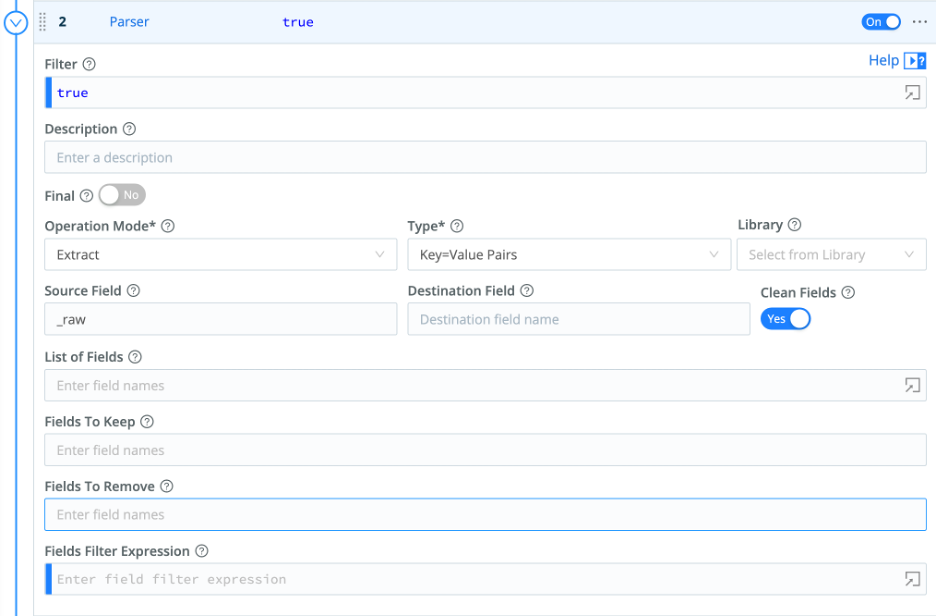

# What is Stream?

Cribl Stream is an observability pipeline tool living between any data source and any destination. These destinations can be systems of analysis (Splunk, Elastic, etc.) or systems of retention (S3 buckets, Data Lakes, etc.). Stream routes, reduces, replays and redacts data sources in flight.

# Basic Elements

Stream uses Sources, Destinations, Routes and Pipelines to move data coming from its sources, processes through its pipelines (group of functions) and send the results to one or many destinations in the format that is best for the environment and its use cases.

## This Labs has 3 parts:

**Part 1 – Introduction to Stream elements**

**Part 2 – Routes and Pipelines**

**Part 3 – Answering to Use Cases**

Access your Cribl Stream instance from the jump box provided using the Chrome web browser pointing to: [Cribl](http://10.233.36.248:9000)
Login as Admin with the password of Go2atc4labs!
 
 
## Part 1 – Introduction to Stream elements

### 1.  Review Sources and Destinations

Sources
LogStream can receive continuous data input from various Sources, including Splunk, HTTP, Elastic Beats, Kinesis, Kafka, TCP JSON, and many others.
Sources can be of a Push or Pull type where Push sources can forward data into Cribl Stream as any other receiving system (Syslog, Splunk, etc.). 
Data from these Sources is normally sent to a set of LogStream Workers through a load balancer. Some Sources, such as Splunk forwarders, have native load-balancing capabilities, so you should point these directly at LogStream.
Pull sources can interact with Stream via REST APIs or other methods available within Stream integrations. For sources not necessarily integrated with Stream Scripts may also be used to collect data from Pull sources.

Destinations
Stream can send data to multiple destinations. These destinations may have native interactions as in sources or being sent at the protocol level such as Syslog, TCP, TCP/Json etc.
There may be Streaming, No Streaming and Other Destinations. These destinations can have integrations (as in Sources) or 
Streaming Destination will forward a continuous flow of data out of Stream to systems or connoting points such as Splunk HEC
Non-Stream Destination wills send data to retention endpoints such as S3 buckets, Azure Blob Storage and others.
Other Destinations will serve special purposes within the data flow.
[Destinations}(https://docs.cribl.io/logstream/destinations)

- Select Data/Sources > Sources from the top menu
- Explore all sources available, filter at the bottom selected top menu for Collectors, Push, Pull, System and Internal sources.

- Select Push > Syslog
Your sources are listed on the left and under Manage Syslog Sources you may configure several Syslog sources. These sources will act as a Syslog server receiving data from any syslog capable device sending data to any existing Syslog server (SyslogNG, Rsylog, etc.).

- Click on the pre-configured source in_syslog and observe the configuration components available for this Source. Note, on the left menu, the out of the box TLS capability.

 
### 2.  Configure a Source
- From the top menu select Data/Sources > Sources then from Push select Syslog
- Click on Add New From the top right button
- Enter the following values: 
- Input ID: Syslog_Source
- Address: 0.0.0.0
- UDP Port: 9514
- TCP Port: 9514
- Click Save and wait until the Live Status becomes green. 

Your source has been configured, in this case Syslog, you may now send data from devices (firewalls, routers, servers, etc.) to the IP address for your Worker Node(s) and start receiving data. 

*Note: no data has been stored on Cribl Stream.* 
 

### 3.  Configure a Splunk Destination
- Select Data/Sources > Destinations
- Click on Splunk Single Instance (Tile)
- Click on Add New From the top right button
- Enter the following values: 
- Output ID: Splunk_Lab
- Address: 10.253.33.249
- Port: 9997
- Backpressure behavior: Block
- Click Save and wait for the Live status to become green
- Click on the Splunk_Lab destination
- Select Test in the context top menu and for Select Sample chose syslog.log
- Click Run Test

Observe the Test Results confirming your sample data was sent and received by the configured destination (Splunk_Lab)

### 4.  Configure an Elastic Destination
- Select Data/Sources > Destinations
- Click on Elasticsearch (Tile)
- Click on Add New From the top right button

**Enter the following values:**

- Output ID: Elasticsearch
- Bulk API URL*: 10.253.33.250
- Index: elastic_lab
- Type: _doc
- Authentication Enabled toggle set to Yes
- Authentication Method button set to Manual
- Username: admin
- Password: Go2atc4labs!
- Backpressure behavior: Block
- Click Save and wait for the Live status to become green
 
- Click on the Elasticsearch destination
- Select Test in the context top menu and for Select Sample chose syslog.log
- Click Run Test

Observe the Test Results confirming your sample data was sent and received by the configured destination (Elasticsearch).

### 5.  Configure a S3 Bucket as Destination
 
For this task we will use an internal object storage solution to represent the S3 behavior or Simple Storage Service (Amazon S3). 

- From the top menu select Data / Destinations. 
- From the list of integrations select the MinIO tile
- Click on Add New From the top right button

**Enter the following values:**

- Output ID: S3_Minio
- MinIO Endpoint*: http://192.168.2.52:9000
- MinIO Bucket Name*: 's3-syslog'
- Staging Location*: $CRIBL_HOME/state/outputs/staging
- Key Prefix*: Cribl
- Partitioning Expression: C.Time.strftime(_time ? _time : Date.now()/1000, '%Y/%m/%d')
- Data Format: json
- File Name Prefix Expression:  `CriblOut`
- File Name Suffix Expression:  `.${C.env["CRIBL_WORKER_ID"]}.${__format}${__compression === "gzip" ? ".gz" : ""}`
- Compress: none
- Backpressure behavior: Block
- Tags: <LEAVE_EMPTY>
- Click Save

**You will be back on the Destinations list. Wait until the Status becomes green:**

- Click on S3_Minio
- On the top menu (in the context window) click Test
- On Select sample chose syslog.log and click Run Test
 
### 6.  Create a S3 Source
 
Now that we have a local S3 destination configured receiving data in your S3 bucket, lets configure a S3 collector to use the Replay function within Cribl Stream. 
We will configure a regular S3 bucket as a Source, the same way you would do if you wanted to read data from an AWS S3 bucket. 
 
- From the list of integrations select the Collectors S3 tile
- Click on Add New From the top right button

**Enter the following values:**

- Output ID: S3_collect
- Auto-populate from: <LEAVE_BLANK>
- S3 bucket*:  's3-syslog'
- Region: <LEAVE_BLANK>
- Path: /Cribl/${_time:%Y}/${_time:%m}/${_time:%d}/
- Extend AUTHENTICATION and Select Manual
- Access key: admin
- Secret key: Go2atc4labs!
- Click Save

**Back to the Sources list**

- Click on the S3_collect source configured
- On the bottom left click Run
- On the new context window click Run

On the result context window, you should see the content from the S3 destination (syslog.log sample file) played back as result

## Quick Connect
Within Cribl Stream you can send data from sources to destinations already configured with a drag and drop action. You may also add a pipeline to your quick connection and process data independently of existing routes (if any configured)

### 7.  Use QuickConnect to send data to Splunk and Elastic
 
- From the top main menu select Routing/QuickConnect
- From Sources (left side) click +New Source
- From the new context window browse to System and Internal and mouse over Datagen then click ‘Select Existing’
- From the list of available datagen sources, select ‘syslog’
- On the new context window click Yes.
- Back on the Quick Connect panel click and drag the mouse connecting the Datagen/syslog (+ sign) to the Splunk Single Instance (SplunkCriblLab) connecting both objects.
 
### 8.  Apply a passthrough and 1 pipeline to the QuickConnect route.
 
A new context window will present you a selection to choose how to process the data in this connected route. 
- Click on Passthru (sending raw data to the destination, no pipelines applied) click save.

### 9.  Analyze the results in Splunk or Elastic (Splunk and Elastic dashboards being created for richer visualization and value realization) 
 
- Mouse over the Single Instance (SplunkCriblLab) Destination and click ‘Capture’ to display if data is being sent to the selected destination. 
- From the new context window validate if syslog data (your datagen source in this case) is being sent to the Splunk Single Instance configured.

Follow the same process to add Elasticsearch as a second destination receiving the same source (Datagen syslog) already sending data to Splunk Single Instance.

- Mouse over Elasticsearch and click on ‘Capture’ to validate if data is being sent to the configured destination.
- Select from the top menu Data/Sources and click the Datagen tile. 
- In the syslog datagen source, click on ‘Connected Destinations’ from the left menu.
- On the right pane click on ‘Send to Routes’
- From the new context window click Yes
- Click Save.

## Part 2 – Routes and Pipelines

Now that we have successfully sent data via QuickConnect, lets use Routes to send data to the same destinations. 
First let’s enable another Source from our Datagen (windows_xml). 
 
### 1.  Enable a new source

- From the top menu click on Data/Source
- Click on the Datagen tile 
- From the Manage Datagen Sources pane click on the no toggle under the Enable column on the windows_xml source.
- On the new context window click Yes.
- On the same source (windows_xml) click on Live under the Status column and validate the proper sources is being generated.
- Click on the top X on the opened context window. 
          
### 2.  Create a new Route

- From the top menu select Routing/Data Routes
- In the Routes panel (left) click the + Route to add a new Route to the existing ones. 

**On the newly create Route enter the following values:**

- Route Name*: to_Splunk
- Filter:  select   __inputId=='datagen:windows_xml'
- Pipeline*: passthru
- Enable Expression: No
- Output: select   splunk:SplunkCriblLab
- Final: No

- Click Save
 
### 3.  Capture sample data from the route created
 
- Make sure your new route is not below any other routes with the Final toggle set to yes, if it is drag it above that final route. 
- From the to_Splunk Route click on the 3 dots and select Capture

On the new context window validate you are capturing samples from your configured Route

- At the bottom right click on Save as Sample File

**On the new context window enter the following values:**

- File Name*: windows_xml_sample.log
- Description: <LEAVE_EMPTY>
- Expiration (hours): <LEAVE_EMPTY>
- Tags: <LEAVE_EMPTY>
 
- From the right pane validate if your sample file has been created (if not refresh your browser) 
- Under Preview click Simple an validate your sample data from your Route.

### 4.  Create a Pipeline

Let’s create a simple pipeline to process our Syslog source.

- Go to the top menu and select Processing / Pipelines
- On the right pane click on the Syslog_sample.log sample file (we will use the captured sample with this Pipeline)
- On the left pane at the top click the ‘+ Pipeline’ button and select ‘Create Pipeline’

- On the left pane, enter only the ID as Syslog_test and click Save.

### 5.  Add functions to the pipeline

- Click on the ‘+ Function’ button on the right most side within the newly create Pipeline

- Mouse click Standard / Eval or type Eval on the mini search bar and click Eval. 
- In the Function values enter the word ‘message’ (no quotes) in the Remove Fields field and click Save.
- Make sure your Syslog_sample.log sample file is loaded on the right pane and validate the results by clicking on the OUT button on the top bar within the Sample data loaded.

Now that we have excluded the field message from the processing logs, lets use another Function “Drop” to reduce our data even further.
- On the left pane click on the **+ Function** button and select Standard/Drop or type Drop on the mini search bar and click on the result.
- With the Function loaded, enter the following values in the field **Filter: appname==’itaque’**

*Note the events matching the filter in the Drop function are greyed out and will not be sent to the destination thus reducing the number of events.*

Let’s add another function to change/redact our data

- From the top bar on the left pane click on the “+ Function” button and select Standard/Rename or type Rename in the mini search bar and click on the result. 
- In the Function click the “+ Add field” button
- Within the Rename fields group type  facilityName in the Current name and NEW_facility_Name in the New Name fields
- Click Save

Observe the results on the right pane with the syslog_sample.log file selected and the OUT button enabled

**Now that we have defined a Pipeline, we need to attach it to a Route.**

### 6.  Add a Pipeline to the Route

- On the left pane within your Splunk_test Pipeline, click on the top left link “Attach to Route”

You will be brought to the Routes list. 
- Select the Syslog_to_Splunk Ruote (created by you earlier)
- In Pipeline select Splunk_test

### 7.  Apply the destination to the Route

Now lets apply the destination that will receive the process stream from this Route.
- From Output select splunk:SplunkCriblLab
- In Description enter: “Sending Syslog data to Splunk”
- Final toggle set to No
- Click Save

### 8.  Analyze results on Splunk or Elastic (no dashboards provided for this part)

- Mouse over the Single Instance (SplunkCriblLab) Destination and click ‘Capture’ to display if data is being sent to the selected destination. 
- From the new context window validate if the syslog data (your datagen source in this case) is being sent to the Splunk Single Instance configured.

**Follow the same process to add Elasticsearch as a second destination to receive the same source (Datagen syslog) as the Splunk Single Instance.**

- Mouse over Elasticsearch and click on ‘Capture’ to validate if data is being sent to the configured destination.
 
### Disconnecting the QuickConnect Routes
Now select from the top menu Data/Sources and click the Datagen tile. 
- In the syslog datagen source click on ‘Connected Destinations’ from the left menu.
- On the right pane click on ‘Send to Routes’
- From the new context window click Yes
- Click Save.
  
  
## Part 3 - Cribl Stream Use Cases
 
### Reduction
Let’s put in practice some of the techniques we learned so far.
Reduction can be done through a series of functions in a pipeline, we will use 2 simple examples on different sources.
 
### 1.  Use the Json reduction elements

**Check if your data source is active and running:**
Data / Source / DataGen
- Big_JSON source should be active and live. (take a look by clicking in the live button) 
- After data stops flowing click on the bottom right button “Save as Sample File”

**On the Sample Files Settings use the following values:**
- File Name: big_json.log
- Description: <LEAVE_BLANK>
- Expiration (hours): delete any values and leave in blank, if you add any number (hours) the sample will be removed after this time.
- Tags: <LEAVE_BLANK>
 
- Click Save
 
**Create a new pipeline from Processing / Pipelines:** *(note your sample file “big_json_data.log” listed on the right panel)*
- Click in the + Pipeline button (top right of the pipelines panel)  / Create Pipeline
- Enter Reduction for ID
Leave all other fields as they are. 
- Click on the top right button (+ Function) to add a function to the Reduction Pipeline
- From the list select Standard / Parser

- Load your sample file (big_json_data.log) from the right panel and expand the _raw field to see its contents. 

**For this usecase we will remove the multiValueHeaders field (which has the same value as the headers) and eliminate any fields that contain the value “null”**

**Enter the following values for the Parser function you’ve just created:**
- Filter: true
- Descripgion: <LEAVE_BLANK>
- Final: No
- Operation Mode: Reserialize
- Type: JSON Object
- Source Field: _raw
- Destination Field: <LEAVE_BLANK>
- List of Fields: <LEAVE_BLANK>
- Fields To Keep: <LEAVE_BLANK>
- Fields To Remove: multiValueHeaders.* 
- Fields Filter Expression: value != null
 
You should see the fields removed on the right panel with the big_json_data.log sample loaded and by clicking the top left OUT button (in the sample panel) 

Visualize results on Cribl Stream basic statistics (no system of analysis required)
- At the top right click on the Basic Statistics icon (to the left of the Select Fields) drop down within the Sample panel:

**You reduced 44.19% of this data source.** 
 
 
### 2.  Create a new S3 destination for the Big Json data reduced.
 
Just as we did in the **Configure a S3 Bucket as Destination** task lets configure a new destination to our S3 storage using a new bucket for this data source (big-json)
 
- From the top menu select Data / Destinations. 
- From the list of integrations select the MinIO tile
- Click on Add New From the top right button

**Enter the following values:** 
- Output ID: Big_Json_reduced
- MinIO Endpoint*: http://192.168.2.52:9000
- MinIO Bucket Name*: ‘big-json’
- Staging Location*: $CRIBL_HOME/state/outputs/staging
- Key Prefix*: Cribl
- Partitioning Expression: C.Time.strftime(_time ? _time : Date.now()/1000, '%Y/%m/%d')
- Data Format: json
- File Name Prefix Expression:  `CriblOut`
- File Name Suffix Expression:  `.${C.env["CRIBL_WORKER_ID"]}.${__format}${__compression === "gzip" ? ".gz" : ""}`
- Compress: none
- Backpressure behavior: Block
- Tags: <LEAVE_EMPTY>
- Click save 
 
Following the same process as in the **Configure a S3 Bucket as Destination** task, validate the configuration for the new Destination (MinIO_Big_Json) 

- Clicking on it and selecting Test from the top menu. 
- From Select Sample: choose big_json.log
- Click the Run Test button (at the top right) 
 
**You should have the following results:** 

### 3.  Send data to a S3 bucket (In this lab will use an internal MinIO server) 
 
To send data to the S3 bucket, we will need to create a new route. 
- From Routing / Data Routes Click the + Route at the top right button within the Routes panel (left)

**Enter the following values:** 
- Route Name*: Big_json_to_S3
- Filter: __inputId=='datagen:Big_JSON'
- Pipeline*: Reduction
- Enable Expression: No
- Output: minio:Big_Json_reduced
- Description: <LEAVE_BLANK>
- Final: No

- Click Save
 
 
### 4.  Check if data has arrived on the S3 bucket. 
 
From the Routes panel, observe that the recently created Route now is sending data to the S3 bucket.

- Click on the three dots next to the **On** toggle and select **Capture**

You should see data coming from your Source, being processed by your Pipeline and sent to your Destination

- Click Cancel (we already have a sample file for this data captured at the Source)
 
 
## Replay
 
### 1.  Configure a S3 Collector Source utilizing the S3 bucket created above
 
Now let’s replay the data sent into the S3 bucket configured above (Big_Json_reduced)

- Go to the main menu at the top and select Sources
- Click on the S3 Collector tile 
- Click on the + Add New button at the top right and enter the following values: 
 
- Collector ID: Big_Json_Collect
- Auto-populate from: <LEAVE_BLANK>
- S3 Bucket: ‘big-json’
- Region: <LEAVE_BLANK>
- Path: /Cribl/${_time:%Y}/${_time:%m}/${_time:%d}/
- Path Extractors: <LEAVE_BLANK>
- Recursive: Yes
- Max Batch Size (objects): 10
 
- Click on AUTHENTICATION expansion
- Authentication Method: Manual
- Access Key: admin
- Secret Key: Go2atc4labs!
 
From the menu on the left select:

- Results Settings / Fields 
- Click on Event Breakers 
- On the right click on + Add Ruleset
- Select Cribl (ndjson breaker)
- Click on Fields on the left

- Click on the + Add Field and enter the following values:
- Name: source
- Value: 'big-json-from-collector'
- Click on Result Routing on the left
- Enter the following values on the right: 
- Send to Routes: Yes
- Pre-Processing Pipeline: time_adjustment
- Throttling: 0
 
Leave all other fields unchanged
 
- Click Save

### 2.  Replay data in preview mode within Cribl Stream

- Back to the Collectors Source from the Big_Json_Collect item in Actions column click Run
- Select Preview and leave all fields unchanged
- Click Run
 
You should have data coming from the S3 Bucket configured with data already reduced by Cribl on the Reduction pipeline earlier.
 

### 3.  Create another route or utilize an existing one (Splunk or Elastic) 

- From the top menu select Routing / Data Routes
- From the Existing **to_Splunk** route select **Filter** and change from __inputId=='datagen:windows_xml' to __inputId=='datagen:Big_JSON'
- Keep the Pipeline as passthru
- Change the default Destination Output to: minio:Big_Json_reduced
- Leave all other fields and toggles unchanged
- Click Save

Validate if data is being sent to the S3 bucket.

- Within the Big_Json_to_S3 route configured above, click on the 3 dots to the right of the **On** toggle:

- Select Capture

You should see data going out to the S3 bucket configured

### 4.  Send data from the S3 bucket in Full mode to route

So far, we have configured a new route capable of sending data to a S3 bucket (using MinIO as destination) and collect data from a S3 bucket (using S3 collector as source), we will now collect that data, apply a Pipeline for a Reduction use case and send that data (reduced) to our Splunk Destination. 

Let’s use the existing **to_Splunk** route and modify its filter, **Pipeline**.

**Expand the to_Splunk route and enter/modify the following values:**

- Route Name*: <NO_CHANGE>
- Filter: source == 'big-json-from-collector'
- Pipeline: Reduction
- Output: <NO_CHANGE>
- Description: <NO_CHANGE>
 
- Click Save

- Select Data / Sources from the top menu
- Click on the S3 tile
- In the Big_Json_Collect source click on Run under the Actions column.
- In the context window select Full Run 
- Click Run

**Note: for this exercise we used the ad-hoc Full Run function, normally S3 Collectors utilize a scheduler to collect and send the results through the available routes that will forward the data to one or many destinations.**

Now let’s check Splunk and validate the data is arriving at its destination after being reduced by Cribl Stream.
 
- From your Jump Box, open a new browser window
- Navigate to: http: 10.0.53.55:8000
- Username: admin
- Password: Go2atc4labs!
- From the Apps menu select Search & Reporting
- In the Search field enter the following search: index=big_json 
- At the end of the search command line select the time picker for last 15 minutes

You should see the following results:

**Go back to Routes in Cribl Stream**

- On the **to_Splunk** route Click on the **On/Off** toggle placing in the **Off** position
 
 
### 7.  Send data to Elastic

Now that we have sent data to MinIO (S3), replayed that data with our S3 Collector and sent the replay to an Splunk instance, we will now send a different source using Syslog data (previously configured in this Lab) to ElasticSearch and validate the results in Kibana.
 
- From the top menu in Cribl Stream click on Routing / Data Sources
- Expand the **to_Elastic** route (previously configured in this lab)
 
**Enter the following values:** 

- Route Name*: <NO_CHANGE>
- Filter: __inputId=='datagen:syslog'
- Pipeline: passthru
- Output: <NO_CHANGE>
- Description: <NO_CHANGE>
- Final: No

Leave all other fields unchanged

- Click Save
 
- From your Jump Box, open a new browser window
- Navigate to: http://10.0.53.59:5601
- No username or password used with Kibana
- In Kibana on the top click on the hamburger menu
- Select Analytics / Discover
- Change the Index Pattern to cribl* under the + Add filter link
- Click on the Time Picker to the left of the Search command line 
- Select Last 30 Minutes
- Click Apply
 
You should see the Syslog data ingested into ElasticSearch:

- Go back to Routes in Cribl Stream
- On the to_Elastic route Click on the On/Off toggle placing in the Off position
 
 
## Redact

For the Redacting usecase we will use a different data source (Business Events). The data source is already configured as a Data Gen source but we need to capture a sample file intoerder to work in our redaction before we send any data into any system of analysis. 
 
- In Cribl Stream top menu select Data / Sources
- Click on the Datagen tile 
- Select the Business_Events Datagen source
- Click on Live Data
- When the capture ends click on the **Save as Sample File** on the bottom right
- Enter the following values: 
- File Name*: Business_events.log
- Description: <LEAVE_BLANK>
- Expiration (hours): delete any number in this field or the sample file will be removed after this value in hours
- Tags: <LEAVE_BLANK>

### 1. Use existing sources

**Lets create a new Pipeline and attach it to an existing route**
 
- From the main menu at the top select Processing / Pipelines
- On the top button at the right click on + Pipeline and select Create Pipeline
- Name the Pipeline Redact

### 2.  Create a Mask Function In the Redact Pipeline

- From the top click on the + Function and select Mask

**Add the following values to the fields in the Mask Function:**
- Filter: true
- Description: <LEAVE_BLANK>
- Final: No

**In the Masking Rules* add 2 rules:**

**Social Security Masking**
- Match Regex: (social=)([0-9]{3}-?[0-9]{2}-?[0-9]{4})
- Replace Expression: `${g1}${C.Mask.md5(g2, g2)}`

**Credit Cards Identify and Hash**
- Match Regex: ([0-9]{14,16})  *Note: Make sure to click on the flags icon and select /g for Global*
- Replace Expression: C.Mask.isCC(g1) ? C.Mask.md5(g1, g1.length) : g1
- Apply to Fields:  *
 
- Click Save

### 3. The Mask Function

The Mask Function has redacted your Social Security and identified a Credit Card number from a common regex pattern distinguishing real Credit Card from regular values and added a hash to both using the same size from the second groups captured in the regex. This function can be used for multiple redacting use cases (I.E.: PII data)

Let’s add a Parser Function and extract fields from the Businessevents.log and validate if the **social** and **cardNumber** fields have been redacted/masked as desired. We can validate that by reading from the _raw but lets exercise what we’ve learned in this Lab. 
 
- From the top right in the left panel (in the Redact Pipeline) click the **+ Function** 
- Select **Parser**

**Enter the following values:** 
- Filter: true
- Description: <LEAVE_BLANK>
- Final: No
- Operation Mode*: Extract
- Type*: Key=Value Pairs
- Library: <LEAVE_BLANK>
- Source Field: _raw
- Desination Field: <LEAVE_BLANK>
- Clean Fields: Yes
- List of Fields: <LEAVE_BLANK>
- Fields to Keep: <LEAVE_BLANK>
- Fields to Remove: <LEAVE_BLANK>
- Fields Filter Expression: <LEAVE_BLANK>
 
- Click Save

### 4.  Validate on the Sample file within Cribl Stream.
 
- On the right panel (Sample files) make sure the Bussinesevents.log is loaded
- Click on the **OUT** at the top left in the Sample Data panel (right)

You should see several fields extracted (Parser function), verify the **social** and **cardNumber** fields have been properly Masked

### 5.  Add an index name and send data to Splunk using a Pipeline

Let’s add an index name in this Pipeline and send this data to Splunk (could be Elastic as well) 

- In the same Pipeline (Redact) click the + Function button on the top right within the left panel (the Redact Pipeline)
- Select Eval
- Enter the following values: 
- Filter: true
- Description: <LEAVE_BLANK>
- Final: No
- Evaluate Fields: + Add Field
- Name: index
- Value Expression: ‘businessevents’
- Keep Fields: <LEAVE_BLANK>
- Remove Fields: <LEAVE_BLANK>
- Click Save

**Send data to Splunk and validate if the fields and values were indexed correctly for the Redact Pipeline**

- From your Jump Box, open a new browser window
- Navigate to: http: 10.0.53.55:8000
- Username: admin
- Password: Go2atc4labs!
- From the Apps menu select Search & Reporting
- In the Search field enter the following search: index=businessevents
- At the end of the search command line select the time picker for last 24 hours

**You should see the following results (Note the cardNumber and social values are hashed)**

