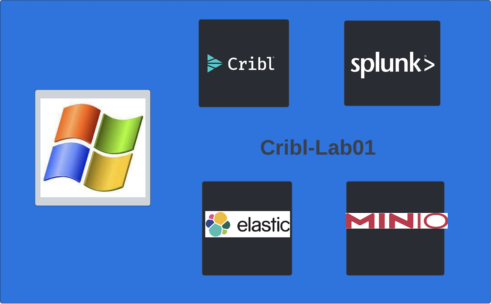

# What is Cribl Stream?

Cribl Stream is an observability pipeline tool living between any data source and any destination. These destinations can be data analysis applications (Splunk, Elastic, etc.) or systems of retention (S3 buckets, Data Lakes, etc.). Cribl Stream routes, reduces, replays and redacts data sources in flight.

## Basic Elements

Cribl Stream uses Sources, Destinations, Routes and Pipelines to move data coming from its sources, processes that data through its pipelines (group of functions) and send the results to one or more destinations in the format that is best for the end user.

## This Lab has 3 Modules

## Module 1 – Introduction to Stream elements

## Module 2 – Routes and Pipelines

## Module 3 – Answering to Use Cases

**Estimated Completion Time:** 1 Hour

## Solution Overview

Cribl Stream puts you in full control of your observability data, providing data management that allows you to optimize the treatment of each of your data sources and multicast it to destinations of your choice--saving you time and money.

## Environment Overview

### Lab Diagram

### Hardware and Software

Although each of the applications in this lab can run as Physical, Virtual, or Cloud, this environment is all virtual.

## Target Audience

This Lab is intended for anyone interested in learning more about Cribl.

## Before You Begin

A basic understanding of how the processing of Data operates and the value Data Analytic applications like Splunk and Elastic bring to organizations around the world.

## Learning Outcomes

This lab has given you an introduction to the Cribl Stream application and has walked you through configuring a few of its basic functions and features. Please look for more Cribl Labs in the future.

## To Begin

Access your Cribl Stream instance from the jump box provided using the Chrome web browser pointing to: [Cribl](<http://10.233.36.248:9000>)

*Login:*

- Username: **Admin**
- Password: **Go2atc4labs!**

### **Module 1 – Introduction to Stream elements**

### 1.  Review Sources and Destinations

#### **Sources**

LogStream can receive continuous data input from various Sources, including Splunk, HTTP, Elastic Beats, Kinesis, Kafka, TCP JSON, and many others.
Sources can be of a Push or Pull type where Push sources can forward data into Cribl Stream as any other receiving system (Syslog, Splunk, etc.).
Data from these Sources is normally sent to a set of LogStream Workers through a load balancer. Some Sources, such as Splunk forwarders, have native load-balancing capabilities, so you should point these directly at LogStream.
Pull sources can interact with Stream via REST APIs or other methods available within Stream integrations. For sources not necessarily integrated with Stream Scripts may also be used to collect data from Pull sources.

#### **Destinations**

Stream can send data to multiple destinations. These destinations may have native interactions as in sources or being sent at the protocol level such as Syslog, TCP, TCP/Json etc.
There may be Streaming, No Streaming and Other Destinations. These destinations can have integrations (as in Sources) or
Streaming Destination will forward a continuous flow of data out of Stream to systems or connoting points such as Splunk HEC
Non-Stream Destination wills send data to retention endpoints such as S3 buckets, Azure Blob Storage and others.
Other Destinations will serve special purposes within the data flow.

!!! note

*For more information goto [Destinations](<https://docs.cribl.io/logstream/destinations>)*

- *Select* **Data/Sources** > **Sources** from the top menu
- Explore all sources available, filter at the bottom selected top menu for Collectors, Push, Pull, System and Internal sources.

- *Select* **Push** > **Syslog**
Your sources are listed on the left and under Manage Syslog Sources you may configure several Syslog sources. These sources will act as a Syslog server receiving data from any syslog capable device sending data to any existing Syslog server (SyslogNG, Rsylog, etc.).

- *Click* the pre-configured source in_syslog and observe the configuration components available for this Source. Note, on the left menu, the out of the box TLS capability.

### 2.  Configure a Source

- From the top menu *Select* **Data/Sources** > **Sources** then from **Push** *Select* **Syslog**
- *Click* **Add New** from the top right button

**Enter the following values:**

- Input ID: **Syslog_Source**
- Address: **0.0.0.0**
- UDP Port: **9514**
- TCP Port: **9514**
- *Click* **Save** and wait until the Live Status becomes green.

!!! note

*Your source has been configured, in this case Syslog, you may now send data from devices (firewalls, routers, servers, etc.) to the IP address for your Worker Node(s) and start receiving data.*

### 3.  Configure a Splunk Destination

- *Select* **Data/Sources** > **Destinations**
- *Click* **Splunk Single Instance** (Tile)
- *Click* **Add New** from the top right button

**Enter the following values:**

- Output ID: **Splunk_Lab**
- Address: **10.253.33.249**
- Port: **9997**
- Backpressure behavior: **Block**
- *Click* **Save** and wait for the Live status to become green
- *Click* **Splunk_Lab** **Destination**
- *Select* **Test** in the context top menu and for **Select Sample**
- *Select* **syslog.log**
- *Click* **Run Test**

Observe the Test Results confirming your sample data was sent and received by the configured destination (Splunk_Lab)

### 4.  Configure an Elastic Destination

- *Select* **Data/Sources** > **Destinations**
- *Click* **Elasticsearch** (Tile)
- *Click* **Add New** from the top right button

**Enter the following values:**

- Output ID: **Elasticsearch**
- Bulk API URL: **10.253.33.250**
- Index: **elastic_lab**
- Type: **_doc**
- *Authentication Enabled* toggle set to **Yes**
- *Authentication Method* button set to **Manual**
- Username: **admin**
- Password: **Go2atc4labs!**
- Backpressure behavior: **Block**
- *Click* **Save** and wait for the Live status to become green

- *Click* **Elasticsearch** destination
- *Select* **Test** in the context top menu and for **Select Sample** chose **syslog.log**
- *Click* **Run Test**

Observe the Test Results confirming your sample data was sent and received by the configured destination (Elasticsearch).

### 5.  Configure a S3 Bucket as Destination

For this task we will use an internal object storage solution to represent the S3 behavior or Simple Storage Service (Amazon S3).

- From the top menu *Select* **Data/Sources** > **Destinations**
- From the list of integrations *Select* **MinIO** tile
- *Click* **Add New** from the top right button

**Enter the following values:**

- Output ID: **S3_Minio**
- MinIO Endpoint: <http://192.168.2.52:9000>
- MinIO Bucket Name: **s3-syslog**
- Staging Location*: **$CRIBL_HOME/state/outputs/staging**
- Key Prefix: **Cribl**
- Partitioning Expression: **C.Time.strftime(_time ?_time : Date.now()/1000, '%Y/%m/%d')**
- Data Format: **json**
- File Name Prefix Expression: **CriblOut**
- File Name Suffix Expression:  **'.${C.env["CRIBL_WORKER_ID"]}.${__format}${__compression === "gzip" ? ".gz" : ""}'**
- Compress: **none**
- Backpressure behavior: **Block**
- Tags: <LEAVE_EMPTY>
- *Click* **Save**

**You should be back on the *Destinations* list. Wait until the Status becomes green:**

- *Click* **S3_Minio**
- On the top menu (in the context window) *Click* **Test**
- On **Select Sample** chose **syslog.log** and *Click* **Run Test**

### 6.  Create a S3 Source

Now that we have a local S3 destination configured receiving data in your S3 bucket, lets configure a S3 collector to use the Replay function within Cribl Stream.
We will configure a regular S3 bucket as a Source, the same way you would do if you wanted to read data from an AWS S3 bucket.

- From the list of integrations *Select* **Collectors S3** tile
- *Click* **Add New** from the top right button

**Enter the following values:**

- Output ID: **S3_collect**
- Auto-populate from: <LEAVE_BLANK>
- S3 bucket: **s3-syslog**
- Region: <LEAVE_BLANK>
- Path: **`/Cribl/${_time:%Y}/${_time:%m}/${_time:%d}/`**
- Extend AUTHENTICATION and *Select* **Manual**
- Access key: **admin**
- Secret key: **Go2atc4labs!**
- *Click* **Save**

#### **Back to the Sources list**

- *Click* **S3_collect** source configured
- On the bottom left *Click* **Run**
- On the new context window *Click* **Run**

On the result context window, you should see the content from the S3 destination (syslog.log sample file) played back as result

## Quick Connect

Within Cribl Stream you can send data from sources to destinations already configured with a drag and drop action. You may also add a pipeline to your quick connection and process data independently of existing routes (if any configured)

### 7.  Use QuickConnect to send data to Splunk and Elastic

- From the top main menu *Select* **Routing/QuickConnect**
- From Sources (left side) *Click* **+New Source**
- From the new context window *Browse* to **System and Internal** 
- *Mouse* over **Datagen** 
- *Click* **Select Existing**
- From the list of available datagen sources *Select* **syslog’**
- On the new context window *Click* **Yes**
- Back on the **Quick Connect** panel *Click and drag* the **Datagen/syslog (+ sign)** to the **Splunk Single Instance(SplunkCriblLab)** connecting both objects.

### 8.  Apply a passthrough and 1 pipeline to the QuickConnect route

A new context window will present you a selection to choose how to process the data in this connected route.

- *Click* **Passthru** (sending raw data to the destination, no pipelines applied) 
- *Click* **Save**

### 9.  Analyze the results in Splunk or Elastic (Splunk and Elastic dashboards being created for richer visualization and value realization)

- *Mouse over* **Single Instance (SplunkCriblLab)** **Destination**
- *Click* **Capture** to display if data is being sent to the selected destination.
- From the new context window validate if syslog data (your datagen source in this case) is being sent to the Splunk Single Instance configured.

Follow the same process to add Elasticsearch as a second destination receiving the same source (Datagen syslog) already sending data to Splunk Single Instance.

- *Mouse over* **Elasticsearch**
- *Click* **Capture** to validate if data is being sent to the configured destination.
- *Select* from the top menu **Data/Sources**
- *Click* the **Datagen** tile
- In the syslog datagen source, *Click* **Connected Destinations** from the left menu.
- On the right pane *Click* **Send to Routes**
- From the new context window *Click* **Yes**
- *Click* **Save**
