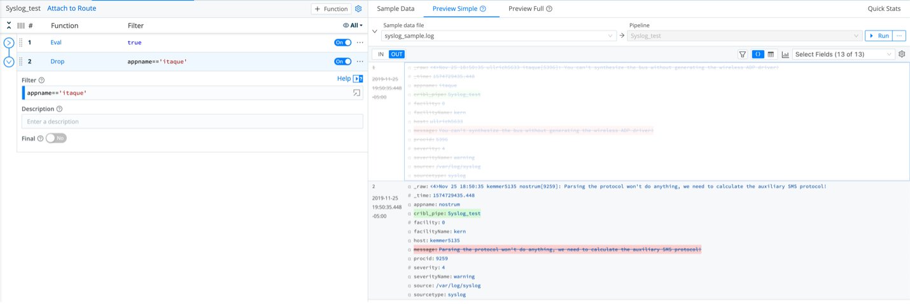

# Welcome to Module 2 of the Cribl-Lab01

## Module 2 – Routes and Pipelines

Now that we have successfully sent data via QuickConnect, lets use Routes to send data to the same destinations.
First let’s enable another Source from our Datagen (windows_xml).

### 1.  Enable a new source

- From the top menu *Click* **Data/Source**
- *Click* **Datagen** tile
- From the **Manage Datagen Sources,** *Click* on the no toggle under the Enable column on the windows_xml source.
- On the new context window *Click* **Yes**
- On the same source (windows_xml) *Click* **Live** under the Status column and validate the proper sources is being generated.
- *Click* on the top **X** on the opened context window.

### 2.  Create a new Route

- From the top menu *Select* **Routing/Data Routes**
- In the Routes panel (left) *Click* the **+Route** to add a new Route to the existing ones.

**On the newly create Route enter the following values:**

- Route Name: **to_Splunk**
- Filter:  *Select*   **__inputId=='datagen:windows_xml'**
- Pipeline*: **passthru**
- Enable Expression: **No**
- Output: *Select*   **splunk:SplunkCriblLab**
- Final: **No**

- *Click* **Save**

### 3.  Capture sample data from the route created

- Make sure your new route is not below any other routes with the Final toggle set to **YES**, if it is drag it above that final route.
- From the **to_Splunk Route** *Click* on the 3 dots and *Select* **Capture**

On the new context window validate you are capturing samples from your configured Route

- At the bottom right, *Click* **Save as Sample File**

**On the new context window enter the following values:**

- File Name*: **windows_xml_sample.log**
- Description: <LEAVE_EMPTY>
- Expiration (hours): <LEAVE_EMPTY>
- Tags: <LEAVE_EMPTY>

- From the right pane validate if your sample file has been created (if not refresh your browser)
- Under **Preview** *Click* **Simple**
- Validate your sample data from your Route

### 4.  Create a Pipeline

Let’s create a simple pipeline to process our Syslog source.

- Go to the top menu, *Select* **Processing / Pipelines**
- On the right pane, *Click* **Syslog_sample.log** (we will use the captured sample with this Pipeline)
- On the left pane at the top, *Click* the **+Pipeline**
- *Select* **Create Pipeline**

- On the left pane, *Enter* the ID as **Syslog_test**
- *Click* **Save**

### 5.  Add functions to the pipeline

- *Click*  **+Function** button on the right most side within the newly create Pipeline

- *Click* *Standard / Eval** or *type* **Eval** on the mini search bar
- *Click* **Eval**
- In the Function values, *Enter* **message** in the **Remove Fields** field
- *Click* **Save**
- Make sure your **Syslog_sample.log** sample file is loaded on the right pane and validate the results by *Clicking* on the **OUT** button on the top bar within the Sample data loaded.

Now that we have excluded the field message from the processing logs, lets use another Function “Drop” to reduce our data even further.

- On the left pane, *Click*  **+Function** button
- *Select* **Standard/Drop** or *Type* **Drop** on the mini search bar
- *Click* on the result
- With the Function loaded, *Enter* in the field Filter: **appname==’itaque’**

!!! note
*The events matching the filter in the Drop function are greyed out and will not be sent to the destination thus reducing the number of events.*

Let’s add another function to change/redact our data

- From the top bar on the left pane, *Click* **+Function** button
- *Select* **Standard/Rename** or *Type* **Rename** in the mini search bar
- *Click* on the result
- In the Function, *Click* **+Add field** button
- Within the **Rename** fields group, *Type* the following:
- **facilityName** in the **Current Name** field
- **NEW_facility_Name** in the **New Name** field
- *Click* **Save**

Observe the results on the right pane with the **syslog_sample.log** file selected and the **OUT** button enabled

**Now that we have defined a Pipeline, we need to attach it to a Route.**

### 6.  Add a Pipeline to the Route

- On the left pane within your Splunk_test Pipeline, *Click* on the top left link **Attach to Route**

You will be brought to the Routes list.

- *Select* **Syslog_to_Splunk Route** (created by you earlier)
- In Pipeline, *Select* **Splunk_test**

### 7.  Apply the destination to the Route

Now lets apply the destination that will receive the process stream from this Route.

- From **Output**, *Select* **splunk:SplunkCriblLab**
- In **Description** *Enter* **Sending Syslog data to Splunk**
- **Final** toggle set to **No**
- *Click* **Save**

### 8.  Analyze results on Splunk or Elastic (no dashboards provided for this part)

- *Mouse over* **Single Instance (SplunkCriblLab) Destination**
- *Click* **Capture** to display if data is being sent to the selected destination.
- From the new context window validate if the syslog data (your datagen source in this case) is being sent to the **Splunk Single Instance** configured.

**Follow the same process to add Elasticsearch as a second destination to receive the same source (Datagen syslog) as the Splunk Single Instance.**

- *Mouse over* **Elasticsearch**
- *Click* **Capture** to validate if data is being sent to the configured destination.

### Disconnecting the QuickConnect Routes

- *Select* from the top menu **Data/Sources**
- *Click* the **Datagen** tile.

- In the syslog datagen source, *Click* **Connected Destinations** from the left menu
- On the right pane, *Click* **Send to Routes**
- From the new context window, *Click* **Yes**
- *Click* **Save**
  