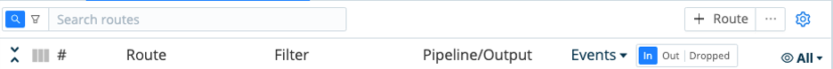
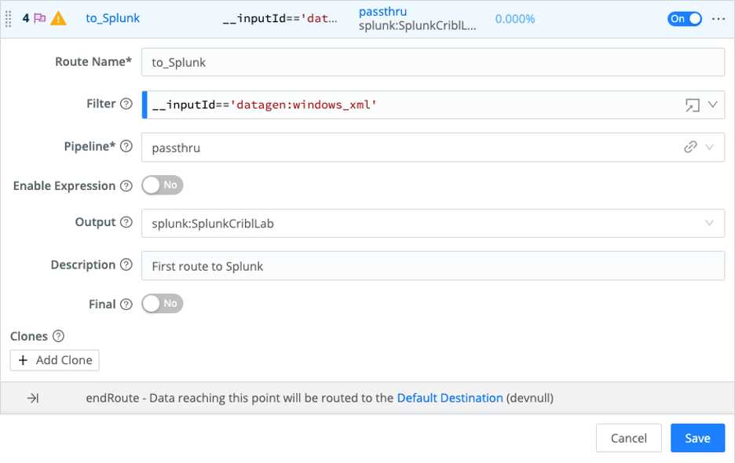
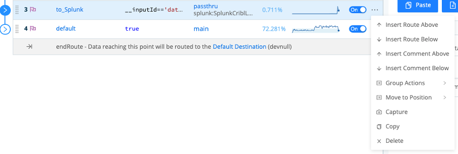
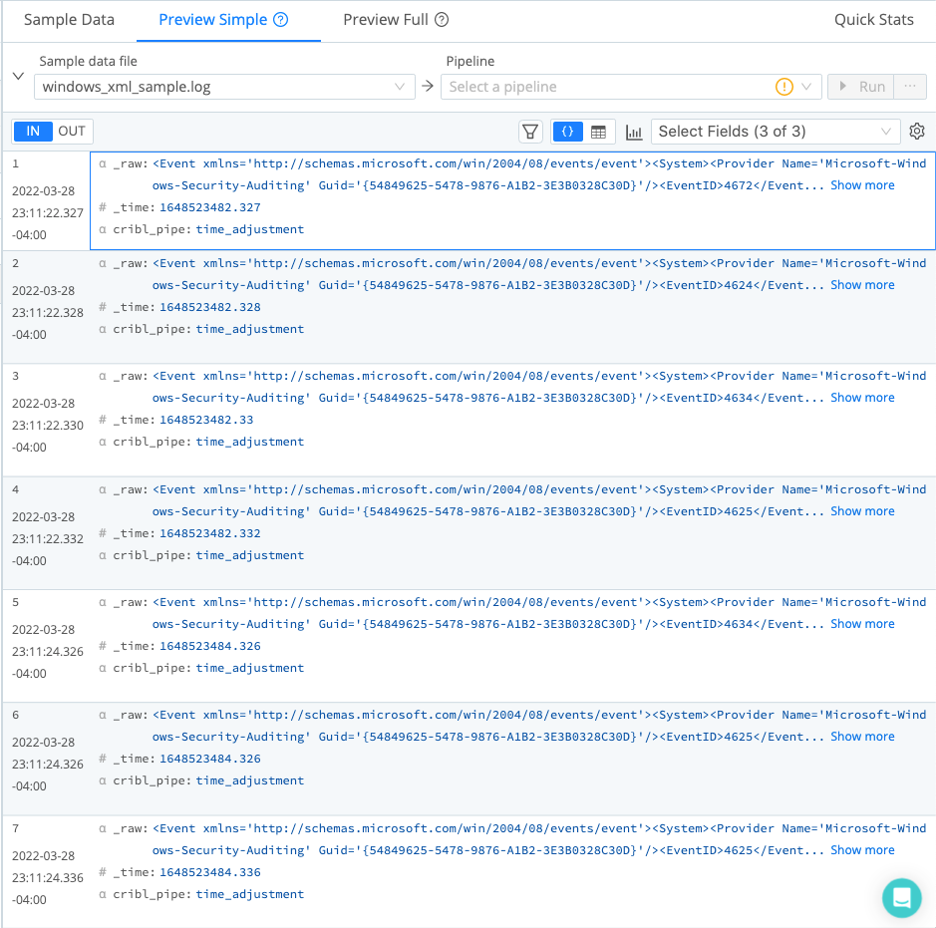
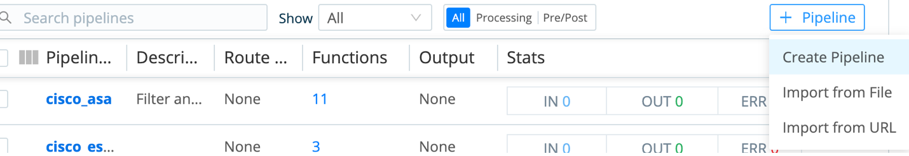
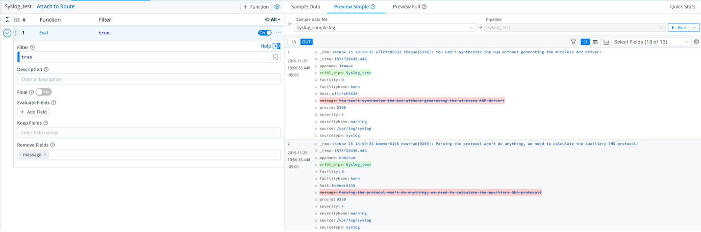
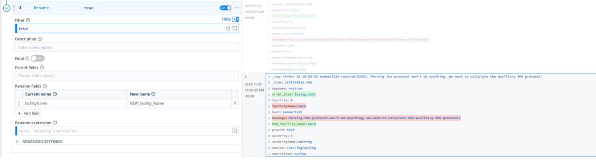
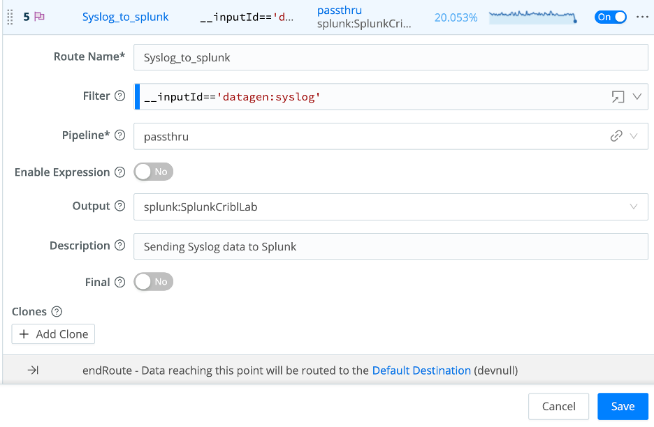

# Welcome to Module 2 of the Cribl-Lab01

## Module 2 – Routes and Pipelines

Now that we have successfully sent data via QuickConnect, lets use Routes to send data to the same destinations.
First let’s enable another Source from our Datagen (windows_xml).

### 1.  Enable a new source

- From the top menu click on Data/Source
- Click on the Datagen tile
- From the Manage Datagen Sources pane click on the no toggle under the Enable column on the windows_xml source.
- On the new context window click Yes.
- On the same source (windows_xml) click on Live under the Status column and validate the proper sources is being generated.
- Click on the top X on the opened context window.

### 2.  Create a new Route

- From the top menu select Routing/Data Routes
- In the Routes panel (left) click the + Route to add a new Route to the existing ones.

**On the newly create Route enter the following values:**

- Route Name*: to_Splunk
- Filter:  select   __inputId=='datagen:windows_xml'
- Pipeline*: passthru
- Enable Expression: No
- Output: select   splunk:SplunkCriblLab
- Final: No

- Click Save

### 3.  Capture sample data from the route created

- Make sure your new route is not below any other routes with the Final toggle set to yes, if it is drag it above that final route.
- From the to_Splunk Route click on the 3 dots and select Capture

On the new context window validate you are capturing samples from your configured Route

- At the bottom right click on Save as Sample File

**On the new context window enter the following values:**

- File Name*: windows_xml_sample.log
- Description: <LEAVE_EMPTY>
- Expiration (hours): <LEAVE_EMPTY>
- Tags: <LEAVE_EMPTY>

- From the right pane validate if your sample file has been created (if not refresh your browser)
- Under Preview click Simple an validate your sample data from your Route.

### 4.  Create a Pipeline

Let’s create a simple pipeline to process our Syslog source.

- Go to the top menu and select Processing / Pipelines
- On the right pane click on the Syslog_sample.log sample file (we will use the captured sample with this Pipeline)
- On the left pane at the top click the ‘+ Pipeline’ button and select ‘Create Pipeline’

- On the left pane, enter only the ID as Syslog_test and click Save.

### 5.  Add functions to the pipeline

- Click on the ‘+ Function’ button on the right most side within the newly create Pipeline

- Mouse click Standard / Eval or type Eval on the mini search bar and click Eval.
- In the Function values enter the word ‘message’ (no quotes) in the Remove Fields field and click Save.
- Make sure your Syslog_sample.log sample file is loaded on the right pane and validate the results by clicking on the OUT button on the top bar within the Sample data loaded.

Now that we have excluded the field message from the processing logs, lets use another Function “Drop” to reduce our data even further.

- On the left pane click on the **+ Function** button and select Standard/Drop or type Drop on the mini search bar and click on the result.
- With the Function loaded, enter the following values in the field **Filter: appname==’itaque’**

*Note the events matching the filter in the Drop function are greyed out and will not be sent to the destination thus reducing the number of events.*

Let’s add another function to change/redact our data

- From the top bar on the left pane click on the “+ Function” button and select Standard/Rename or type Rename in the mini search bar and click on the result.
- In the Function click the “+ Add field” button
- Within the Rename fields group type  facilityName in the Current name and NEW_facility_Name in the New Name fields
- Click Save

Observe the results on the right pane with the syslog_sample.log file selected and the OUT button enabled

**Now that we have defined a Pipeline, we need to attach it to a Route.**

### 6.  Add a Pipeline to the Route

- On the left pane within your Splunk_test Pipeline, click on the top left link “Attach to Route”

You will be brought to the Routes list.

- Select the Syslog_to_Splunk Ruote (created by you earlier)
- In Pipeline select Splunk_test

### 7.  Apply the destination to the Route

Now lets apply the destination that will receive the process stream from this Route.

- From Output select splunk:SplunkCriblLab
- In Description enter: “Sending Syslog data to Splunk”
- Final toggle set to No
- Click Save

### 8.  Analyze results on Splunk or Elastic (no dashboards provided for this part)

- Mouse over the Single Instance (SplunkCriblLab) Destination and click ‘Capture’ to display if data is being sent to the selected destination.
- From the new context window validate if the syslog data (your datagen source in this case) is being sent to the Splunk Single Instance configured.

**Follow the same process to add Elasticsearch as a second destination to receive the same source (Datagen syslog) as the Splunk Single Instance.**

- Mouse over Elasticsearch and click on ‘Capture’ to validate if data is being sent to the configured destination.

### Disconnecting the QuickConnect Routes

Now select from the top menu Data/Sources and click the Datagen tile.

- In the syslog datagen source click on ‘Connected Destinations’ from the left menu.
- On the right pane click on ‘Send to Routes’
- From the new context window click Yes
- Click Save.
  