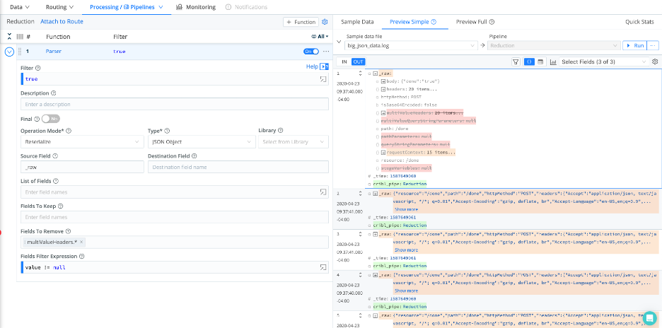
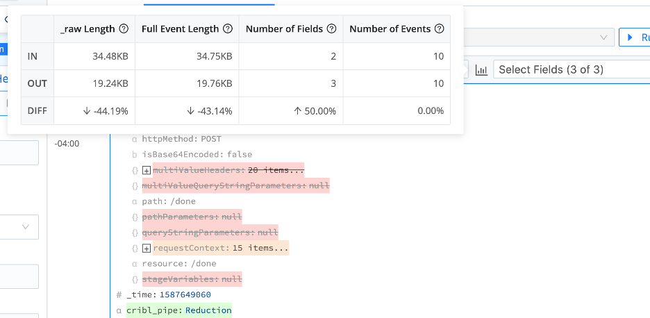
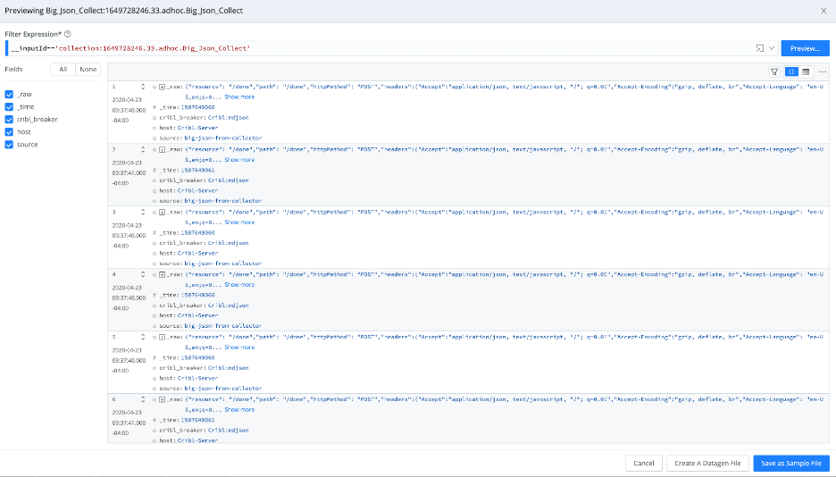
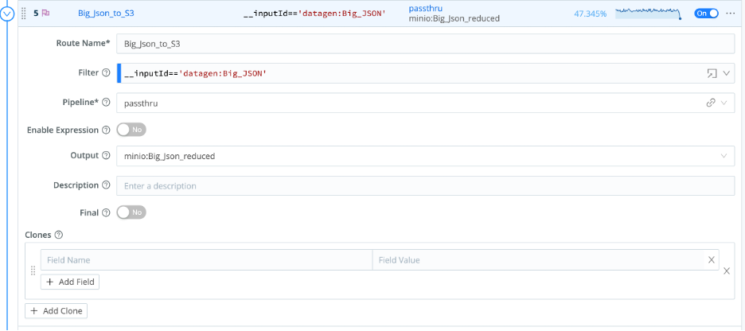
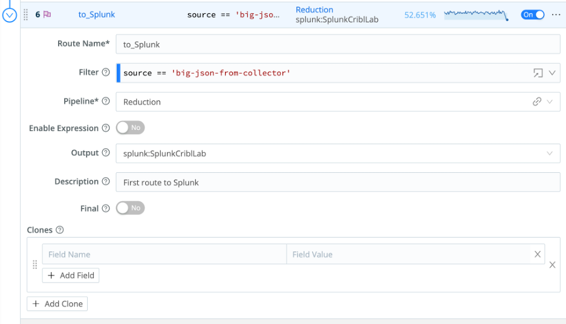
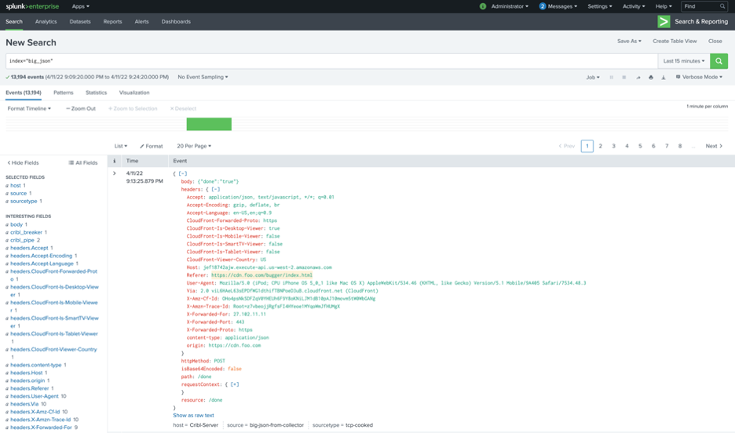
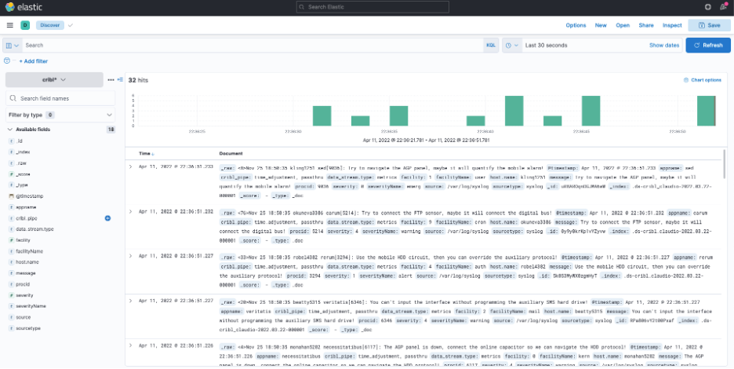
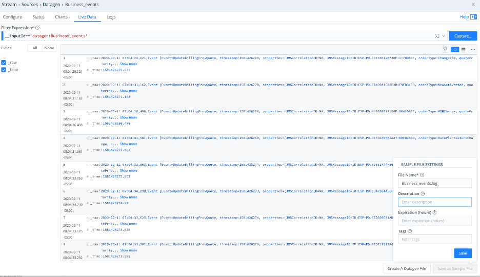
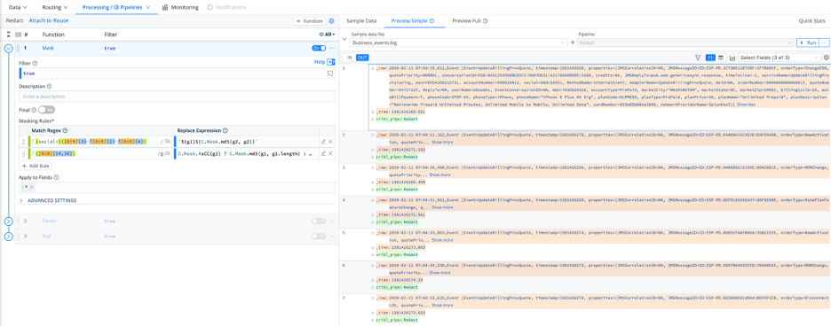
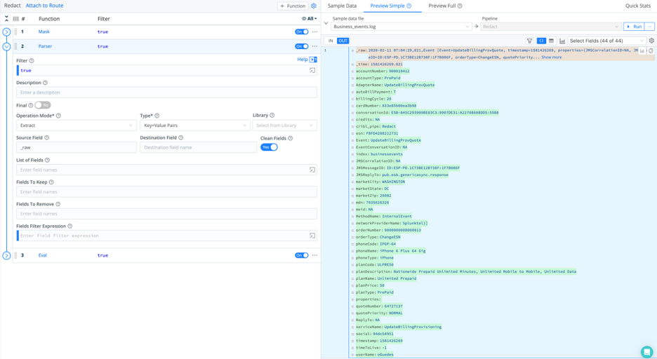

# Welcome to Module 3 of the Cribl-Lab01  
  
## Module 3 - Cribl Stream Use Cases

### Reduction

Let’s put in practice some of the techniques we learned so far.
Reduction can be done through a series of functions in a Pipeline, we will use 2 simple examples on different sources.

### 1.  Use the Json reduction elements

**Check if your data source is active and running:**
Data / Source / DataGen

- **Big_JSON** source should be active and live. (take a look by *Clicking* in the **Live** button)
- After data stops flowing, *Click* on the bottom right button **Save as Sample File**

**On the Sample Files Settings use the following values:**

- File Name: **big_json.log**
- Description: <LEAVE_BLANK>
- Expiration (hours): delete any values and leave blank, if you add any number (hours) the sample will be removed after this time.
- Tags: <LEAVE_BLANK>

- *Click* **Save**

**Create a new pipeline from Processing / Pipelines:**

!!! note
*Your sample file “big_json_data.log” should be listed on the right panel)*

- *Click* **+Pipeline** button (top right of the pipelines panel)  
- *Select* **Create Pipeline**
- *Enter* **Reduction** for ID
Leave all other fields as they are.
- *Click* **+Function** to add a function to the Reduction Pipeline
- From the list, *Select* **Standard/Parser**

- Load your sample file (big_json_data.log) from the right panel and expand the _raw field to see its contents.

!!! tip
***For this usecase we will remove the multiValueHeaders field (which has the same value as the headers) and eliminate any fields that contain the value “null”***

**Enter the following values for the Parser function you’ve just created:**

- Filter: **true**
- Descripgion: <LEAVE_BLANK>
- Final: **No**
- Operation Mode: **Reserialize**
- Type: **JSON Object**
- Source Field: **_raw**
- Destination Field: <LEAVE_BLANK>
- List of Fields: <LEAVE_BLANK>
- Fields To Keep: <LEAVE_BLANK>
- Fields To Remove: **multiValueHeaders.***
- Fields Filter Expression: **value != null**

- In the right panel, load **big_json_data.log** sample file
- *Click* **OUT** button in the sample panel
- You should see the fields have been removed

Visualize results on Cribl Stream basic statistics (no system of analysis required)

- At the top right, *Click* on the **Basic Statistics** icon (to the left of the Select Fields):

**You have reduced this data source by 44.19%**

### 2.  Create a new S3 destination for the Big Json data reduced

Just as we did in the **Configure a S3 Bucket as Destination** task lets configure a new destination to our S3 storage using a new bucket for this data source (big-json)

- From the top menu, *Select* **Data / Destinations**
- From the list of integrations, *Select* **MinIO** tile
- *Click* **Add New** from the top right button

**Enter the following values:**

- Output ID: **Big_Json_reduced**
- MinIO Endpoint: <http://192.168.2.52:9000>
- MinIO Bucket Name: **big-json**
- Staging Location: **$CRIBL_HOME/state/outputs/staging**
- Key Prefix: **Cribl**
- Partitioning Expression: **`C.Time.strftime(_time ?_time : Date.now()/1000, '%Y/%m/%d')`**
- Data Format: **json**
- File Name Prefix Expression: **CriblOut**
- File Name Suffix Expression: **`.${C.env["CRIBL_WORKER_ID"]}.${__format}${__compression === "gzip" ? ".gz" : ""}`**
- Compress: **none**
- Backpressure behavior: **Block**
- Tags: <LEAVE_EMPTY>
- *Click* **Save**

Following the same process as in the **Configure a S3 Bucket as Destination** task, validate the configuration for the new **Destination** (**MinIO_Big_Json**)

- *Click* on **Destinatios > MinIO > Big_Json_reduced**
- *Select* **Test** from the top menu
- From **Select Sample**, *Select* **big_json.log**
- *Click* **Run Test** (at the top right)

**You should have the following results:**

### 3.  Send data to a S3 bucket (In this lab will use an internal MinIO server)

To send data to the S3 bucket, we will need to create a new route.

- From **Routing / Data Routes**, *Click* the **+Route** at the top right button within the Routes panel (left)

**Enter the following values:**

- Route Name: **Big_json_to_S3**
- Filter: **__inputId=='datagen:Big_JSON'**
- Pipeline: **Reduction**
- Enable Expression: **No**
- Output: **minio:Big_Json_reduced**
- Description: <LEAVE_BLANK>
- Final: **No**

- *Click* **Save**

### 4.  Check if data has arrived on the S3 bucket

From the Routes panel, observe that the recently created Route now is sending data to the S3 bucket.

- *Click* the three dots next to the **On** toggle
- *Select* **Capture**

You should see data coming from your Source, being processed by your Pipeline and sent to your Destination

- *Click* **Cancel** (we already have a sample file for this data captured at the Source)

## Replay

### 1.  Configure a S3 Collector Source utilizing the S3 bucket created above

Now let’s replay the data sent into the S3 bucket configured above (Big_Json_reduced)

- Go to the main menu at the top, *Select* **Sources**
- *Click* **S3 Collector** tile
- *Click* **+Add New** button at the top right

**Enter the following values:**

- Collector ID: **Big_Json_Collect**
- Auto-populate from: <LEAVE_BLANK>
- S3 Bucket: **big-json**
- Region: <LEAVE_BLANK>
- Path: `/Cribl/${_time:%Y}/${_time:%m}/${_time:%d}/`
- Path Extractors: <LEAVE_BLANK>
- Recursive: **Yes**
- Max Batch Size (objects): **10**

- *Click* **AUTHENTICATION** expansion
- Authentication Method: **Manual**
- Access Key: **admin**
- Secret Key: **Go2atc4labs!**

From the menu on the left select:

- Results Settings / Fields
- *Click* **Event Breakers**
- On the right, *Click* **+Add Ruleset**
- *Select* **Cribl (ndjson breaker)**
- *Click* **Fields** on the left

- *Click* **+Add Field**

**Enter the following values:**

- Name: **source**
- Value: **big-json-from-collector**
- *Click* **Result Routing** on the left

**Enter the following values on the right:**

- Send to Routes: **Yes**
- Pre-Processing Pipeline: **time_adjustment**
- Throttling: **0**

Leave all other fields unchanged

- *Click* **Save**

### 2.  Replay data in preview mode within Cribl Stream

- On the Collectors Source from the Big_Json_Collect item in Actions column *Click* **Run**
- *Select* **Preview** and leave all fields unchanged
- *Click* **Run**

You should have data coming from the S3 Bucket configured with data already reduced by Cribl on the Reduction Pipeline earlier.

### 3.  Create another route or utilize an existing one (Splunk or Elastic)

- From the top menu, *Select* **Routing / Data Routes**
- *Select*  **to_Splunk** route

**Enter the following values:**

- Filter: **__inputId=='datagen:Big_JSON'**
- Pipeline: **passthru**
- Output: **minio:Big_Json_reduced**
- Leave all other fields and toggles unchanged
- *Click* **Save**

Validate if data is being sent to the S3 bucket.

- Within the Big_Json_to_S3 route configured above, *Click* the 3 dots to the right of the **On** toggle:

- *Select* **Capture**

You should see data going out to the S3 bucket configured

### 4.  Send data from the S3 bucket in Full mode to route

So far, we have configured a new route capable of sending data to a S3 bucket (using MinIO as destination) and collect data from a S3 bucket (using S3 collector as source), we will now collect that data, apply a Pipeline for a Reduction use case and send that data (reduced) to our Splunk Destination.

Let’s use the existing **to_Splunk** route and modify its filter, **Pipeline**.

**Expand the to_Splunk route and enter/modify the following values:**

- Route Name*: <NO_CHANGE>
- Filter: **source == 'big-json-from-collector'**
- Pipeline: **Reduction**
- Output: <NO_CHANGE>
- Description: <NO_CHANGE>

- *Click* **Save**

- *Select* **Data / Sources**
- *Click* the **S3** tile
- In the **Big_Json_Collect** source, *Click* **Run** under the **Actions** column.
- In the context window, *Select* **Full Run**
- *Click* **Run**

**Note: for this exercise we used the ad-hoc Full Run function, normally S3 Collectors utilize a scheduler to collect and send the results through the available routes that will forward the data to one or many destinations.**

Now let’s check Splunk and validate the data is arriving at its destination after being reduced by Cribl Stream.

- From your Jump Box, open a new browser window
- Navigate to: <http://10.0.53.55:8000>
- Username: **admin**
- Password: **Go2atc4labs!**
- From the **Apps** menu, *Select* **Search & Reporting**
- In the **Search** field, *Enter* the following search: **index=big_json**
- At the end of the search command line, *Select* the time picker for **last 15 minutes**

You should see the following results:

#### **Go back to Routes in Cribl Stream**

- On the **to_Splunk** route, *Click* **On/Off** toggle placing in the **Off** position

### 7.  Send data to Elastic

Now that we have sent data to MinIO (S3), replayed that data with our S3 Collector and sent the replay to an Splunk instance, we will now send a different source using Syslog data (previously configured in this Lab) to ElasticSearch and validate the results in Kibana.

- From the top menu in Cribl Stream, *Click* **Routing / Data Sources**
- Expand the **to_Elastic** route (previously configured in this lab)

**Enter the following values:**

- Route Name*: <NO_CHANGE>
- Filter: **__inputId=='datagen:syslog'**
- Pipeline: **passthru**
- Output: <NO_CHANGE>
- Description: <NO_CHANGE>
- Final: **No**

Leave all other fields unchanged

- *Click* **Save**

- From your Jump Box, open a new browser window
- Navigate to: <http://10.0.53.59:5601>
- No username or password used with Kibana
- In Kibana on the top, *Click* on the hamburger menu
- *Select* **Analytics / Discover**
- Change the Index Pattern to **cribl*** under the **+ Add filter** link
- *Click* on the **Time Picker** to the left of the Search command line
- *Select* **Last 30 Minutes**
- *Click* **Apply**

You should see the Syslog data ingested into ElasticSearch:

- Go back to **Routes** in Cribl Stream
- On the to_Elastic route, *Click*  **On/Off** toggle placing in the **Off** position

## Redact

For the Redacting usecase we will use a different data source (Business Events). The data source is already configured as a Data Gen source but we need to capture a sample file intoerder to work in our redaction before we send any data into any system of analysis.

- In Cribl Stream top menu, *Select* **Data / Sources**
- *Click* **Datagen** tile
- *Select* **Business_Events** **Datagen** source
- *Click* **Live Data**
- When the capture ends, *Click* **Save as Sample File** on the bottom right

**Enter the following values:**

- File Name: **Business_events.log**
- Description: <LEAVE_BLANK>
- Expiration (hours): delete any number in this field or the sample file will be removed after this value in hours
- Tags: <LEAVE_BLANK>

### 1. Use existing sources

#### **Lets create a new Pipeline and attach it to an existing route**

- From the main menu at the top, *Select* **Processing / Pipelines**
- On the top button at the right, *Click* **+Pipeline**
- *Select* **Create Pipeline**
- Name the Pipeline **Redact**

### 2.  Create a Mask Function In the Redact Pipeline

- From the top, *Click* **+Function**
- *Select* **Mask**

**Add the following values to the fields in the Mask Function:**

- Filter: **true**
- Description: <LEAVE_BLANK>
- Final: **No**

### **In the Masking Rules add 2 rules:**

#### **Social Security Masking**

- Match Regex: **(social=)([0-9]{3}-?[0-9]{2}-?[0-9]{4})**
- Replace Expression: **`${g1}${C.Mask.md5(g2, g2)}`**

#### **Credit Cards Identify and Hash**

- Match Regex: **([0-9]{14,16})**  
Note: Make sure to *Click* on the flags icon and *Select* /g for Global

- Replace Expression: **`C.Mask.isCC(g1) ? C.Mask.md5(g1, g1.length) : g1`**
- Apply to Fields: *

- *Click* **Save**

### 3. The Mask Function

The Mask Function has redacted your Social Security and identified a Credit Card number from a common regex pattern distinguishing real Credit Card from regular values and added a hash to both using the same size from the second groups captured in the regex. This function can be used for multiple redacting use cases (I.E.: PII data)

Let’s add a Parser Function and extract fields from the Businessevents.log and validate if the **social** and **cardNumber** fields have been redacted/masked as desired. We can validate that by reading from the _raw but lets exercise what we’ve learned in this Lab.

- From the top right in the left panel (in the Redact Pipeline), *Click* **+ Function**
- *Select* **Parser**

**Enter the following values:**

- Filter: **true**
- Description: <LEAVE_BLANK>
- Final: **No**
- Operation Mode: **Extract**
- Type: **Key=Value Pairs**
- Library: <LEAVE_BLANK>
- Source Field: **_raw**
- Desination Field: <LEAVE_BLANK>
- Clean Fields: **Yes**
- List of Fields: <LEAVE_BLANK>
- Fields to Keep: <LEAVE_BLANK>
- Fields to Remove: <LEAVE_BLANK>
- Fields Filter Expression: <LEAVE_BLANK>

- *Click* **Save**

### 4.  Validate on the Sample file within Cribl Stream

- On the right panel (Sample files) make certain the **Bussinesevents.log** is loaded
- *Click* **OUT** at the top left in the **Sample Data** panel (right)

You should see several fields extracted (Parser function), verify the **social** and **cardNumber** fields have been properly Masked

### 5.  Add an index name and send data to Splunk using a Pipeline

Let’s add an index name in this Pipeline and send this data to Splunk (could be Elastic as well)

- In the same **Pipeline (Redact)**, *Click* **+Function** button on the top right within the left panel (the Redact Pipeline)
- *Select* **Eval**

**Enter the following values:**

- Filter: **true**
- Description: <LEAVE_BLANK>
- Final: **No**
- Evaluate Fields: **+Add Field**
- Name: **index**
- Value Expression: **businessevents**
- Keep Fields: <LEAVE_BLANK>
- Remove Fields: <LEAVE_BLANK>
- *Click* **Save**

#### **Send data to Splunk and validate if the fields and values were indexed correctly for the Redact Pipeline**

- From your Jump Box, open a new browser window
- Navigate to: <http://10.0.53.55:8000>
- Username: **admin**
- Password: **Go2atc4labs!**
- From the **Apps** menu, *Select* **Search & Reporting**
- In the Search field, *Enter* the following search: **index=businessevents**
- At the end of the search command line, *Select* the time picker for **last 24 hours**

#### **You should see the following results (Note the cardNumber and social values are hashed)**

